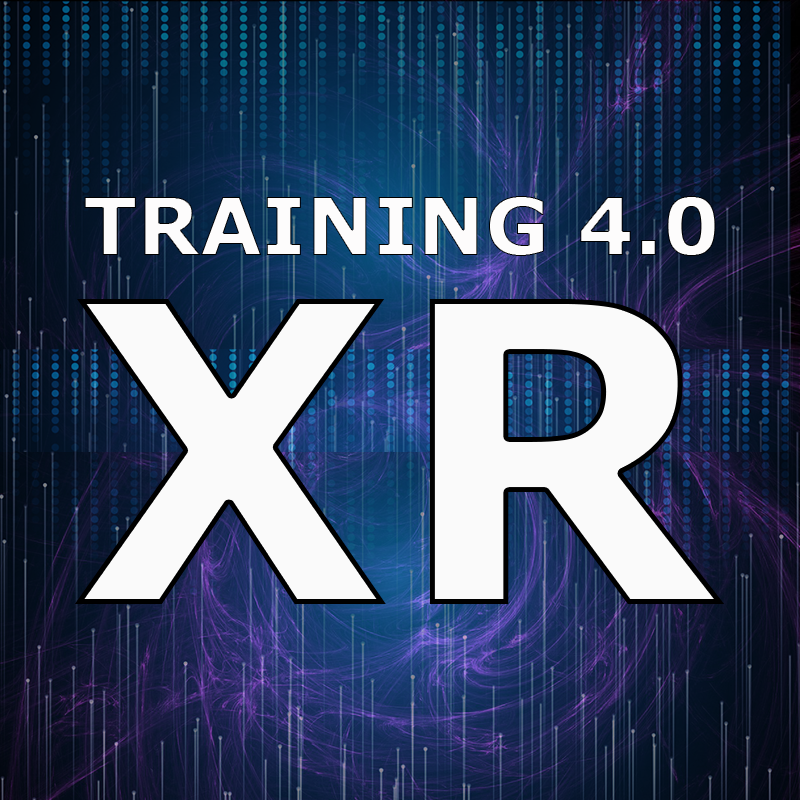

# TR4XR - Collection of XR related links

Updated: 20.10.2022

## AR
[Babylon.js - WebXR Augmented Reality features](https://doc.babylonjs.com/features/featuresDeepDive/webXR/webXRARFeatures)

[Google model viewer -Easily display interactive 3D models on the web & in AR](https://modelviewer.dev/)

[AR.js - Web-based AR, location, marker and image based tracking](https://ar-js-org.github.io/AR.js-Docs/)

[AR- GLTF material variants](https://www.khronos.org/blog/streamlining-3d-commerce-with-material-variant-support-in-gltf-assets)

[Apple AR Quick Look](https://developer.apple.com/augmented-reality/quick-look/)

[Add AR to an online shop using WebXR and ThreeJS](https://niklever.com/add-ar-to-an-online-shop-using-webxr-and-threejs/)

[Zappar -The world’s leading augmented reality platform and creative studio](https://www.zappar.com/)

[Needle Engine is a web-based runtime for 3D apps](https://needle.tools/)

[GLTF -Royalty-free specification for the efficient transmission and loading of 3D scenes and models by engines and applications.](https://www.khronos.org/gltf/)

[GLTF ISO standard](https://80.lv/articles/khronos-gltf-2-0-becomes-an-iso-iec-international-standard/)

## VR

[Visual components - Visual Components Experience 1.6 VR](https://youtu.be/xVWZfHN0Z4k?t=131)

[Shariiing VR -guide HMD users with visual cues in all your VR experiences](https://youtu.be/OdNKtVJmv_I)

[Nvida omniverse - industrial metaverse](https://www.nvidia.com/en-us/omniverse/)

[ABB RobotStudio - Teach robots in virtual reality](https://youtu.be/wtD4QcAWcoE)

## MR

[Dynamics 365 Guide with HoloLens 2 | Mixed Reality Demo](https://youtu.be/sCMjkCkw11I)

## 3D MODELING

[Nvidia GANverse3D – 2D Photo to a 3D Model with texture at a click of a button](https://youtu.be/r5E4ThTukc4)

[JAMK 2017 - 3D-mallintamisen perusteet Blenderillä](https://github.com/JAMK-IT/iim80110-3d-mallintamisen-perusteet)

[AI Generates 3D models from photos](https://youtu.be/dZ_5TPWGPQI)

[Autodesk Revit - how to export FBX with materials](https://youtu.be/jVpf0ve1QV0)

[Broowood 3D videotutoriaali, Aitaelementin mallintaminen Blenderillä, OSA 1 ](https://youtu.be/jhj2kgtXZ0Q)

[Broowood 3D videotutoriaali, Aitaelementin mallintaminen Blenderillä, OSA 2](https://youtu.be/tBTwp7DkrrE)

[Juha Keränen - Blender Mallinnus osa](https://youtu.be/TMiXg7sv0Ng)

[Peliobjektin 3D-mallinnus | Blender-tutoriaali](https://youtu.be/L2D_LXuKZgE)

[Learning Blender - A step by step beginner Tutorial for 3D Artists](https://youtu.be/g2U0MiZSV9A)

[How To Export An FBX To Unity From Blender With Textures?](https://www.blenderbasecamp.com/home/how-to-export-an-fbx-to-unity-from-blender-with-textures/)

[Retopology in Blender -Beginner Tutorial](https://youtu.be/X2GNyEUvpD4)

[Blender 2.8 basics - crash course playlist](https://www.youtube.com/watch?v=-O52Js1c5D4&list=PL3GeP3YLZn5j31ES1VUMXi7M0U1QvSpoQ&ab_channel=CGCookie)

[Blender 2.8 Wooden Floor Tutorial (Eevee / Cycles Materials)](https://youtu.be/ikNnhaPGjiI)

[Blender workflow to modding models to farming simulator 2019](https://youtu.be/LUf0_tu8JDA)

[Blender tutorial - modding tractor trailer to farming simulator](https://youtu.be/Pa8BsYm3D58)

[Blender turn hi poly mesh to game ready object](https://youtu.be/9kq72GpvsT0)

[Blender - Getting Started with SNAPPING in Blender](https://youtu.be/0p06F1LzTjQ)

[AWESOME BLENDER GITHUB ](https://github.com/agmmnn/awesome-blender)

[CGCOOKIE - Learn Blender 2.8 and beyond - The Basics Tutorial](http://cgcookie.com/courses/learn-blender-2-8-and-beyond-the-basics-tutorial) 

[Brandon's Drawings -  50 BLENDER TIPS](https://youtu.be/4YDf_ctubbI)

[3D Tinkerer - What Are Normals? 3D Fundamentals Blender 2.8](https://youtu.be/lmMD9fV98Co)

## CAD

[Opinnäytetyö-CAD-tiedostomuotojen vertailu Unreal Engine -pelimoottorilla](https://www.theseus.fi/bitstream/handle/10024/172734/Ahola_Tiina_cad_tiedostomuotojen_vertailu_unrealenginella.pdf?sequence=2&isAllowed=y)

[Visual components-Simplify an imported 3D CAD file](https://youtu.be/SGvTN5H2FVE)

[Turning large CAD assemblies into real-time 3D visualizations - Unite Copenhagen 2019](https://youtu.be/BNUZLnhCR2Q)

[Autodesk Inventor 2022: Simplify Command to remove features from model like holes and small parts](https://youtu.be/CVNK1WzALhE)

[Solidworks - Defeature, remove feautres and details from your model](https://www.youtube.com/watch?v=6CEgSuG6DcA&ab_channel=SolidSolutions-ProfessionalDesignSolutions)

[Autodesk Fusion 360 - Remove internals from your desings](https://www.youtube.com/watch?v=GvfBFwsOq5c&ab_channel=AutodeskFusion360)

## UNITY

[Introduction to Unity | 2022 Unity Beginner's Course ](https://www.youtube.com/watch?v=VaJseHy_iI4&list=PLS7jk2aVN8G4b-uuf-M0_fhQjL7KEmQwU&ab_channel=Yeahlowflicker)

[Unity XR interaction toolkit - socket interactor  ](https://docs.unity3d.com/Packages/com.unity.xr.interaction.toolkit@2.0/manual/xr-socket-interactor.html)

[Blender animation to Unity](https://youtu.be/uWexElqDcaA)

[Photon Fusion 101 - Photon Fusion network architecture and basics](https://youtu.be/lLSv1memaBA)

[Valem tutorials - How to make a VR game in UNITY in 2022](https://www.youtube.com/watch?v=fM0k2n7u8sc&list=PLpEoiloH-4eP-OKItF8XNJ8y8e1asOJud&ab_channel=ValemTutorials)

[VR with Andrew - XR Toolkit 2.0 Crash Course using Unity 2021](https://youtu.be/5ZBkEYUyBWQ)

[Justin P Barnett -How to use VR Sockets and XR Interaction Toolkit in Unity 2021.2](https://youtu.be/rRNvq09Itdw)

## UNREAL ENGINE

[Unreal Engine - Lumen and Nanite in VR, Impressions of Virtual Production](https://youtu.be/sawt17ZFBZA)

## PROGRAMS

[KAMK.FI - Clever simulation ladattavat hyötyöpelit](https://www.cleversimulation.com/projects)

## PAPERS

[VAMR -XR technologies for industrial SMEs: The VAMR*s University-Business Cooperation Handbook](https://vam-realities.eu/wp-content/uploads/VAM-Realities_UBC_Handbook.pdf)

[XR bootcamp - Unity vs Unreal - how to decide which engine to use in your next XR project](https://xrbootcamp.com/unity-vs-unreal-engine-for-xr-development/)

[Extended reality technologies in small and medium-sized European industrial companies: level of awareness, diffusion and enablers of adoption](https://www.researchgate.net/publication/361626411_Extended_reality_technologies_in_small_and_medium-sized_European_industrial_companies_level_of_awareness_diffusion_and_enablers_of_adoption)

## PROJECTS

[VAM-REALITIES- ERASMUS+](https://vam-realities.eu/)

[Mobiili VR/AR - EAKR](https://projektit.seamk.fi/alykkaat-teknologiat/mobiili-vr-ar-pk-teollisuudessa/)

[Kexri.io - EAKR](https://kexri.io/)

[Vattu – Valmistavan teollisuuden virtuaaliset tuotteet - EAKR](https://www.hamk.fi/projektit/vattu/)

## ASSETS AND FRAMEWORKS

[78 photorealistic Cars and Vehicles rigged for Blender](https://blendermarket.com/products/transportation)

[Auto-hand - vr interaction](https://assetstore.unity.com/packages/tools/game-toolkits/auto-hand-vr-interaction-165323)

[Real materials lite URP](https://assetstore.unity.com/packages/2d/textures-materials/real-materials-lite-urp-152926)

[Aweseome unity 3D -A categorized collection of awesome opensource unity3d resources](https://github.com/insthync/awesome-unity3d)

[Readyplayer.me SDK - custom avatars to Unity](https://docs.readyplayer.me/ready-player-me/integration-guides/unity-sdk/unity-sdk-download)

[VRMADA - VR toolset for quickly building immersive interactions for VR within Unity](https://www.roadtovr.com/ultimatexr-vr-interaction-development-framework-unity-vrmada/)

[NVIDIA Material Definition Language (MDL) SDK is a set of tools to enable quick integration of physically-based materials into rendering applications.](https://developer.nvidia.com/rendering-technologies/mdl-sdk)

[Real materials vol 0 - free materials to Unity](https://assetstore.unity.com/packages/2d/textures-materials/real-materials-vol-0-free-115597)

[THE BASE MESH -Free 3D base meshes](https://thebasemesh.com/model-library)

# USE CASES

[Unity - Industrial stories](https://unity.com/pages/industrial-stories)

[Lumon - työntekijöiden perhdytys VR:n avulla](https://youtu.be/bnPH2JK5Ioo)

## OTHER

[How we film mixed reality videos](https://youtu.be/v2YY-Eq3Fe4)

[LIV- film yourself inside VR-games](https://store.steampowered.com/app/755540/LIV/)

